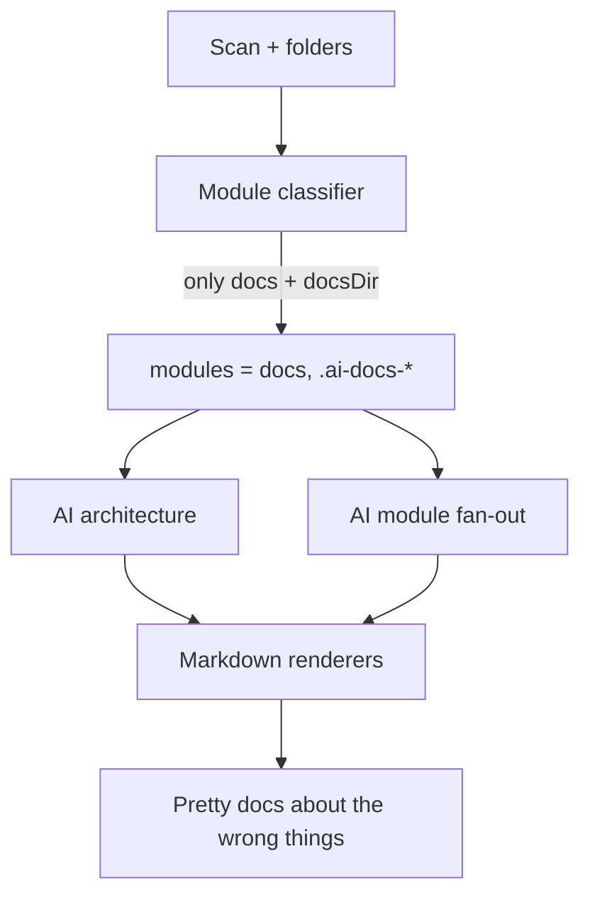
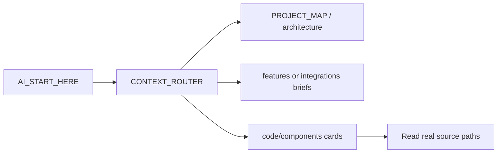

# Agent-efficient documentation (generic, playbook-style)

## Overview

Upgrade ai-project-docs so **any** target repository gets agent-efficient navigation docs: correct modules first, richer PKM facts, more OpenRouter stages for project mapping, then playbook-style START_HERE / router / code cards.

This plan is **not** a jarvis-desktop / Angular / TypeScript-only feature. Jarvis examples are only:

- a **UX reference** for how good agent docs feel to navigate
- a **smoke-test target** among others (any stack)

Core analyzers, prompts, and renderers must stay **stack-agnostic**. Framework-specific depth belongs in technology plugins (`src/plugins/technology/`), not hardcoded into the pipeline.

## Design principle — generic first

| Layer | Must work for | Must not assume |
|---|---|---|
| Module discovery | npm, pnpm/yarn workspaces, Maven/Gradle, .NET solutions, Go modules, Cargo, Python packages, plain multi-folder monorepos | Always Angular, always `apps/`, always `package.json` only |
| Operational context | README, lockfiles/manifests, `.env.example` / common env templates, common script/task entry points | Electron IPC, RxJS, specific product partitions |
| AI stages | Compact PKM summary of whatever was detected | Product names, frameworks, or folder layouts not present in PKM |
| Renderers | Purpose, layers, env, run, router, module cards from PKM | Jarvis partition names, Angular/Electron sections |

**Rule:** if a fact is not in the PKM (or a safe, known config file for that ecosystem), do not invent it. Prefer honest `Unknown` / `Partial` over fake completeness.

## Todos

- [ ] **phase1-modules** — Multi-manifest / workspace module discovery + exclude docsDir from product AI fan-out + fixtures for root packages (JS) and at least one non-JS layout signal
- [ ] **phase1-ops** — Add operationalContext to PKM (purpose, scripts/tasks, env keys) via safe boundary reads across common ecosystems
- [ ] **phase2-ai-stages** — Upgrade architecture schema/prompt; add capability-map + router AI stages; skip documentation-only modules; prompts stay language-agnostic
- [ ] **phase3-renderers** — Rewrite AI_START_HERE, AGENTS.md, CONTEXT_ROUTER; add code/index + feature/integration stubs from PKM (no stack-specific templates)
- [ ] **phase4-verify** — Smoke-run on jarvis-smart-phone **and** existing generic fixtures; validate modules + navigation quality without assuming Angular/TS

## Goal

Make generated docs behave like a strong agent entry protocol (same *job* as jarvis-desktop `AI_START_HERE`: short orientation, real architecture, env/run when known, then a router to minimum docs/code) — for **whatever stack the detector finds**.

**Default for this plan:** ship a strong **agent navigation core** (modules + START_HERE + router + code cards + capability briefs). Defer product-specific partitions, Cursor skills, and PONTO-style backlogs to a later effort.

## Why current output fails (example: jarvis-smart-phone)

Root cause: [module-classifier.ts](src/analyzers/module-classifier.ts) only treats children of `apps/`, `packages/`, `libs/`, … and fixed `src/*` paths. Root packages like `bridge-server/` and `mobile/` never become modules, so AI documents documentation folders. The same gap hits **any** monorepo that does not use those folder names (Java multi-module, .NET solution folders, Go multi-module, etc.).

## Target agent flow

## Phase 1 — Fix discovery and operational facts (deterministic, stack-agnostic)

Without this, more AI calls only amplify wrong modules.

1. **Manifest-aware module discovery (multi-ecosystem)**
   - Extend [module-classifier.ts](src/analyzers/module-classifier.ts) + [module-constants.ts](src/analyzers/module-constants.ts) (and analyzer via `PluginContext.boundary`).
   - Keep existing container rules for `apps/*`, `packages/*`, etc. as heuristics.
   - **Also** treat as modules folders that own a package/project manifest, for example:
     - JS/TS: `package.json` (including npm/pnpm/yarn `workspaces` members)
     - .NET: `*.csproj` / `*.fsproj` / `*.sln` children
     - Java/Kotlin: `pom.xml`, `build.gradle` / `build.gradle.kts`
     - Go: `go.mod`
     - Rust: `Cargo.toml`
     - Python: `pyproject.toml`, `setup.cfg` (when they clearly scope a package)
   - Reads stay limited to known safe config names through `RepositoryBoundary` — no full source scrape.
   - **Demote or exclude** the configured `docsDir` from product module fan-out (still list it as documentation, do not AI-document it as a core module).
   - Tests: root-level JS packages fixture **and** at least one non-JS manifest signal fixture (e.g. nested `pom.xml` or `*.csproj`) so discovery is not npm-only.

2. **Operational facts in PKM** (safe reads only)
   - New contribution, e.g. `analysis.operationalContext`:
     - `purpose` (README first meaningful paragraph / root manifest description)
     - `runCommands[]` / tasks when detectable (npm scripts, and later common task files if already in tree — do not invent Angular/`ng serve`)
     - `envVars[]` (keys only from `.env.example` or equivalent templates — never values)
   - Persist in knowledge writer; no secrets.
   - If a stack has no scripts/env file, omit sections honestly.

3. **Technology detection for nested packages / projects**
   - Surface frameworks from nested manifests into `technologies` (or per-module tech), so START_HERE is not “frameworks: none” when Express, Spring, ASP.NET, etc. live under a child package.
   - Framework-specific enrichment stays in technology plugins; core only aggregates detected signals.

## Phase 2 — More AI stages to map the project (language-agnostic prompts)

Wire through `ANALYSIS_PIPELINE` + handlers (same pattern as architecture / module docs). Providers stay transport-only; prompts live in [prompt-builder.ts](src/ai/prompt-builder.ts).

| Stage | When | Calls | Writes to PKM | Feeds |
|---|---|---|---|---|
| Architecture (upgrade) | `--ai` | 1 | `stagedDocumentation.architecture` with richer schema | `AI_START_HERE`, `architecture.md` |
| Capability map (new) | `--ai` | 1 | e.g. `stagedDocumentation.capabilityMap` | `features/`, `integrations/`, router |
| Module docs (upgrade) | `--ai` | 1 per **source** module | `moduleResults` | `code/components/*.md` |
| Router enrichment (new) | `--ai` | 1 | e.g. `stagedDocumentation.router` | `CONTEXT_ROUTER.md` |

**Architecture JSON schema upgrade** (still single object, no inventing):

- `purpose`, `layers[]`, `asciiDiagram`, `keyConstraints[]`, `envVars[]`, `runCommands[]`, `risks[]`, `agentGuidance[]`
- Prompt must include Phase 1 operational facts + real modules (not docsDir).
- System/user instructions must say: describe **this repository’s detected stack only**; never assume Angular, Java, C#, Electron, or any framework not listed in the PKM summary.

**Capability map JSON** (inventory only, capped):

- `features[]`, `domains[]`, `integrations[]` each with `name`, `summary`, `entryPaths[]`, `relatedModules[]`
- Grounded only in PKM folders/modules/deps; mark unknowns explicitly.
- Names come from detected structure (folder/module responsibility), not a fixed product taxonomy.

**Module card schema + rendering:**

- Keep structured fields; **renderer must emit Markdown sections** (Purpose / Entry points / …), not concatenated prose.
- Prefer `importantFiles` and dependency edges as concrete paths.
- Cards describe whatever module type was classified (`application`, `library`, `service-group`, …) — no UI-framework assumptions.

**Cost control:** sequential calls; skip documentation-only modules; compact prompts; optional CLI flag later (e.g. `--skip-capability-map`) if needed — default: run when `--ai` is on.

## Phase 3 — Render playbook docs (generic agent protocol)

Deterministic renderers consume PKM (+ staged AI sections labeled as enrichment). Section titles stay generic (Purpose, Architecture, Environment, Run, Load next) — never “Angular Renderer” unless that string came from PKM/AI grounded in detection.

1. **[ai-start-here-renderer.ts](src/docs/markdown-renderers/ai-start-here-renderer.ts)**  
   Sections: Project Purpose → Architecture Summary (diagram + constraint) → Environment Setup → How to run → Main components → What to Load Next.  
   Omit empty sections when operational facts are missing.

2. **New `agents-renderer.ts` for `.ai-docs/AGENTS.md`**  
   30-second “Working on X → Read Y” table derived from **discovered modules / nav map**, not hardcoded product areas + hard rules + tiny flow.

3. **[context-router-renderer.ts](src/docs/markdown-renderers/context-router-renderer.ts)**  
   Merge navigation map + capability map + module doc paths; task-type routes and a short “by area” table built from **actual module names/paths** (e.g. whatever packages exist), not “mobile UI / bridge” hardcoding.

4. **Planner additions** in [documentation-planner.ts](src/docs/documentation-planner.ts)
   - `code/index.md` (entry-point index)
   - `features/<slug>/index.md` (and integrations) from capability map when `--ai` produced it; otherwise honest `Partial` stubs from modules only
   - Update [DOCUMENTATION_STATUS](src/docs/markdown-renderers/documentation-status-renderer.ts) / impact analyzer for new paths

5. **Navigation rules** in [navigation-map-builder.ts](src/analyzers/navigation-map-builder.ts)  
   Recommend `AI_START_HERE.md` / `CONTEXT_ROUTER.md` first; point to real module cards.

## Phase 4 — Verify on multiple targets

1. Re-run against `C:\projeto\jarvis-smart-phone` with `--ai` into a fresh docs dir (one real multi-package TS case).
2. Also validate against in-repo fixtures (`fixture-monorepo`, `fixture-typescript`, and the new root-package / non-JS-manifest fixtures) **without** requiring `--ai` for discovery correctness.

**Success criteria (generic):**

- Modules include real application/library packages for the layout under test (not only `docs` / docsDir)
- Dependency graph has edges when the stack’s imports are detectable, or honest limitations
- `AI_START_HERE` states product purpose and only env/scripts that were detected
- Module AI docs are about application modules; structured Markdown; no invented frameworks
- `CONTEXT_ROUTER` routes by discovered areas, not a fixed product map
- Agent can go START_HERE → router → one module card → code without scanning the whole tree

## Explicitly out of scope (later)

- Product partitions (Assistant vs Builder) and Cursor skills/`PONTO.md` — those are **project-specific** harnesses, not core generator behavior
- Hardcoding Angular / Java / C# / Electron documentation templates in core
- Full domain encyclopedia for every subfolder
- Reading arbitrary source files into prompts (stay PKM + safe configs only)
- Changing jarvis-desktop docs themselves

## Implementation order (when executing)

1. Multi-manifest module discovery + tests (unblocks everything)
2. Operational context in PKM (stack-agnostic)
3. Architecture prompt/schema + START_HERE renderer (generic sections)
4. Capability map stage + feature/integration stubs + router
5. Module card render polish + docsDir exclusion from AI fan-out
6. AGENTS.md renderer + navigation rule updates
7. Smoke on jarvis-smart-phone **plus** generic fixtures

## Key files

- Analyzers: [module-classifier.ts](src/analyzers/module-classifier.ts), [module-constants.ts](src/analyzers/module-constants.ts), [module-analyzer.ts](src/analyzers/module-analyzer.ts)
- AI: [prompt-builder.ts](src/ai/prompt-builder.ts), [ai-analysis-service.ts](src/ai/ai-analysis-service.ts), [module-documentation-stage.ts](src/ai/module-documentation-stage.ts), new stage module(s)
- Pipeline: [pipeline.ts](src/domain/pipeline.ts), [pipeline-handlers.ts](src/core/pipeline-handlers.ts)
- Docs: [documentation-planner.ts](src/docs/documentation-planner.ts), [ai-start-here-renderer.ts](src/docs/markdown-renderers/ai-start-here-renderer.ts), [context-router-renderer.ts](src/docs/markdown-renderers/context-router-renderer.ts)
- Reference UX only: jarvis-desktop agent entry style + playbook [AI_AGENT_DOCUMENTATION_PLAYBOOK.md](AI_AGENT_DOCUMENTATION_PLAYBOOK.md)
- Stack-specific depth: [src/plugins/technology/](src/plugins/technology/) (not core renderers)
